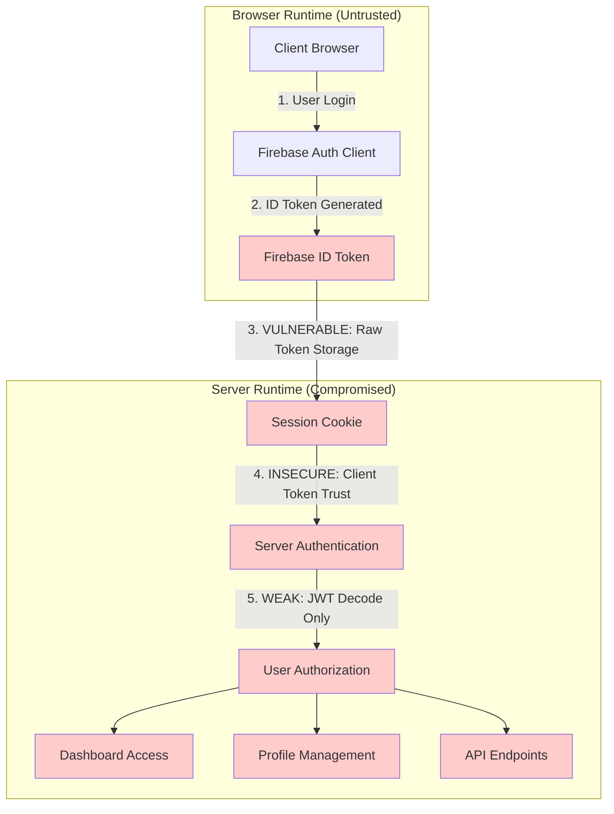
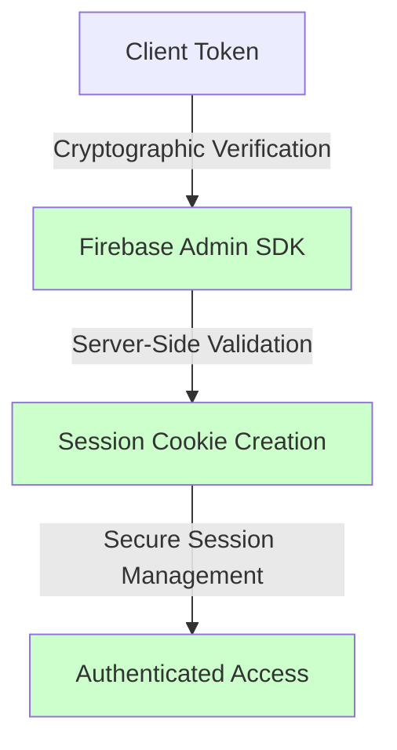
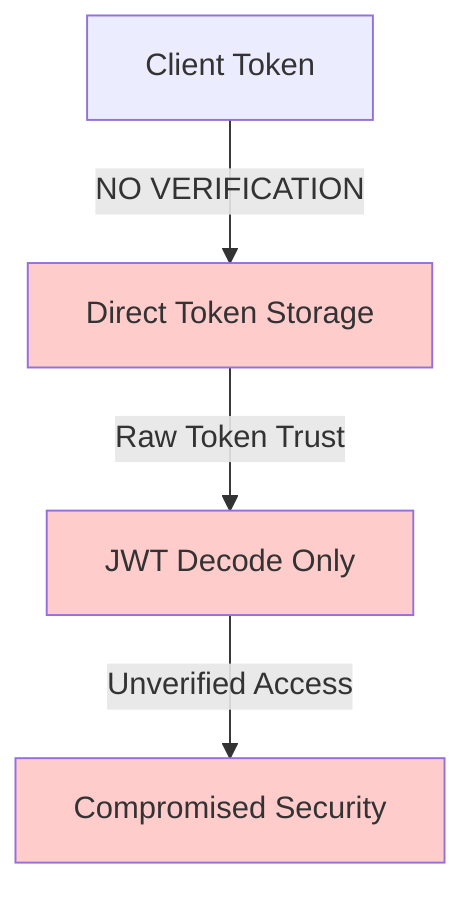

# Comprehensive Security Assessment Report
## PrepBettr Application - Authentication Security Analysis

### Document Information
- **Assessment Date**: January 2025
- **Application**: PrepBettr (AI-Powered Interview Platform)
- **Scope**: Authentication Architecture Security Review
- **Assessment Type**: White-box security analysis
- **Criticality Level**: **CRITICAL**

---

## Executive Summary

### Assessment Overview

This comprehensive security assessment reveals **critical vulnerabilities** in the PrepBettr application's authentication architecture. The primary security concern stems from a migration from secure server-side Firebase Admin SDK verification to client-side token trust, fundamentally compromising the application's security model.

### Key Findings Summary

| **Security Domain** | **Risk Level** | **Impact** | **Exploitable** |
|-------------------|----------------|------------|-----------------|
| **Authentication Bypass** | CRITICAL | Complete system compromise | ✅ Yes |
| **Token Tampering** | CRITICAL | Privilege escalation | ✅ Yes |
| **Session Management** | HIGH | Account takeover | ✅ Yes |
| **Identity Spoofing** | CRITICAL | Impersonation attacks | ✅ Yes |
| **Data Integrity** | HIGH | Unauthorized data access | ✅ Yes |

### Business Impact Assessment

- **Immediate Risk**: Complete authentication bypass allowing unauthorized system access
- **Data Exposure**: User profiles, interview data, and platform analytics at risk
- **Compliance Impact**: Potential violations of data protection regulations
- **Reputation Risk**: High risk of security incidents affecting user trust
- **Financial Impact**: Potential for data breaches, service disruption, and remediation costs

### Recommendation Priority

**🚨 IMMEDIATE ACTION REQUIRED**: The application is currently unsuitable for production deployment due to fundamental authentication security flaws.

---

## Application Architecture Analysis

### Current Architecture Overview



### Security Architecture Impact

#### **Before (Secure Firebase Admin SDK)**


#### **After (Vulnerable Client-Side Trust)**


---

## Detailed Security Findings

### 1. Authentication Bypass (CRITICAL)

#### **Vulnerability Description**
The application bypasses Firebase Admin SDK server-side verification, directly trusting client-provided ID tokens without cryptographic validation.

#### **Affected Components**
- `/app/api/auth/signin/route.ts`
- `/lib/actions/auth.action.ts::signIn()`
- `/lib/actions/auth.action.ts::setSessionCookie()`
- `/lib/utils/jwt-decoder.ts`

#### **Technical Details**
```typescript
// VULNERABLE CODE - Direct token storage without verification
export async function setSessionCookie(idToken: string) {
    // Skip creating a session cookie with the Firebase Admin SDK
    // Just use the ID token directly
    cookieStore.set("session", idToken, {
        maxAge: SESSION_DURATION,
        httpOnly: true,
        // ... other options
    });
}
```

#### **Exploitation Vector**
1. Attacker crafts malicious JWT token with valid structure
2. Token contains elevated privileges or false identity claims
3. Server accepts token without cryptographic verification
4. Attacker gains unauthorized system access

### 2. Token Tampering Vulnerability (CRITICAL)

#### **Vulnerability Description**
The custom JWT decoder (`lib/utils/jwt-decoder.ts`) performs only basic validation without cryptographic signature verification.

#### **Technical Analysis**
```typescript
// VULNERABLE CODE - No signature verification
export function decodeFirebaseToken(token: string): DecodedToken | null {
    const parts = token.split('.');
    const payload = parts[1]; // Only decodes payload, ignores signature
    const decoded = Buffer.from(paddedPayload, 'base64url').toString('utf8');
    // Missing: Cryptographic signature validation
}
```

#### **Proof of Concept Exploit**

**Step 1: Token Structure Analysis**
```bash
# Valid Firebase token structure
Header.Payload.Signature
eyJhbGciOiJSUzI1NiIsInR5cCI6IkpXVCJ9.PAYLOAD.SIGNATURE
```

**Step 2: Payload Manipulation**
```javascript
// Original payload
{
  "uid": "user123",
  "email": "user@example.com",
  "role": "user",
  "exp": 1640995200
}

// MALICIOUS payload modification
{
  "uid": "user123", 
  "email": "admin@example.com",
  "role": "admin",           // ⚠️ Privilege escalation
  "exp": 2640995200         // ⚠️ Extended expiration
}
```

**Step 3: Token Forgery**
```bash
# Encode malicious payload
echo '{"uid":"user123","email":"admin@example.com","role":"admin"}' | \
  base64 -w 0 | tr '+/' '-_' | tr -d '='

# Create forged token (signature ignored by decoder)
FORGED_TOKEN="eyJhbGciOiJSUzI1NiJ9.MALICIOUS_PAYLOAD.FAKE_SIGNATURE"
```

### 3. Session Fixation Vulnerability (HIGH)

#### **Vulnerability Description**
Raw ID tokens stored as session cookies without server-side session management enable session fixation attacks.

#### **Attack Scenario**
1. Attacker obtains or predicts session cookie value
2. Victim authenticates with attacker-controlled session
3. Attacker accesses authenticated session using known cookie

#### **Code Evidence**
```typescript
// Session cookie set with raw ID token
cookieStore.set("session", idToken, {
    maxAge: SESSION_DURATION,  // Fixed duration, no rotation
    httpOnly: true,
    // Missing: Session ID rotation on authentication
});
```

### 4. Privilege Escalation Vulnerability (CRITICAL)

#### **Vulnerability Description**
User roles and permissions extracted from unverified token claims allow privilege escalation attacks.

#### **Affected Components**
- Dashboard access control (`app/dashboard/layout.tsx`)
- Profile management endpoints
- Role-based feature access

#### **Exploitation Proof of Concept**
```typescript
// ATTACK: Modify token claims for privilege escalation
const maliciousToken = {
    "uid": "regular_user_123",
    "email": "user@example.com",
    "custom_claims": {
        "role": "admin",           // ⚠️ Escalated privilege
        "permissions": ["admin_access", "user_management"]
    },
    "exp": Math.floor(Date.now() / 1000) + 3600
};

// Server trusts these claims without verification
const userData = getUserFromDecodedToken(maliciousToken);
// Result: Regular user gains admin access
```

### 5. Cross-Site Session Vulnerabilities (HIGH)

#### **Vulnerability Description**
Inconsistent authentication validation across endpoints creates attack vectors for cross-site session abuse.

#### **Mixed Implementation Analysis**
| **Endpoint** | **Verification Method** | **Security Status** |
|-------------|------------------------|-------------------|
| `/api/auth/signin` | Client token trust | ❌ Vulnerable |
| `/api/auth/signup` | Firebase Admin SDK | ✅ Secure |
| `/api/profile/me` | JWT decode only | ❌ Vulnerable |
| `/api/profile/update` | Firebase Admin SDK | ✅ Secure |

---

## Attack Scenario Modeling

### Scenario 1: Complete Authentication Bypass

**Attack Flow:**
1. **Reconnaissance**: Attacker analyzes client-side authentication implementation
2. **Token Crafting**: Creates malicious JWT with valid structure but false claims
3. **Session Establishment**: Submits forged token to signin endpoint
4. **Privilege Escalation**: Modifies token claims for elevated access
5. **System Compromise**: Gains full access to dashboard and user data

**Impact:** Complete system compromise, unauthorized data access

### Scenario 2: Session Hijacking via Token Replay

**Attack Flow:**
1. **Token Interception**: Attacker intercepts valid session token via XSS or MITM
2. **Token Analysis**: Extracts user data and permissions from JWT payload
3. **Session Replay**: Uses intercepted token to impersonate user
4. **Lateral Movement**: Accesses profile data and performs actions as victim

**Impact:** Account takeover, unauthorized actions, data theft

### Scenario 3: Mass Privilege Escalation

**Attack Flow:**
1. **Token Template Creation**: Develops script to generate admin tokens
2. **Batch Account Creation**: Creates multiple accounts with elevated privileges
3. **Administrative Access**: Gains admin control over platform
4. **Data Exfiltration**: Accesses all user data and platform analytics

**Impact:** Complete platform compromise, mass data breach

---

## STRIDE Threat Analysis

### Spoofing (Identity Threats)
| **Threat** | **Current Risk** | **Impact** | **Exploitable** |
|------------|------------------|------------|-----------------|
| Identity Impersonation | CRITICAL | Complete user impersonation | ✅ |
| Admin Account Spoofing | CRITICAL | Platform admin access | ✅ |
| Service Account Abuse | HIGH | Backend service access | ✅ |

### Tampering (Data Integrity)
| **Threat** | **Current Risk** | **Impact** | **Exploitable** |
|------------|------------------|------------|-----------------|
| Token Payload Modification | CRITICAL | Privilege escalation | ✅ |
| Session Data Manipulation | HIGH | Unauthorized data changes | ✅ |
| Claims Tampering | CRITICAL | Role/permission bypass | ✅ |

### Repudiation (Non-repudiation)
| **Threat** | **Current Risk** | **Impact** | **Exploitable** |
|------------|------------------|------------|-----------------|
| Action Deniability | HIGH | Cannot prove user actions | ⚠️ |
| Audit Trail Compromise | MEDIUM | Incomplete security logs | ⚠️ |

### Information Disclosure (Confidentiality)
| **Threat** | **Current Risk** | **Impact** | **Exploitable** |
|------------|------------------|------------|-----------------|
| User Profile Data Exposure | HIGH | PII disclosure | ✅ |
| Interview Data Leakage | HIGH | Sensitive content access | ✅ |
| Platform Analytics Exposure | MEDIUM | Business intelligence leak | ✅ |

### Denial of Service (Availability)
| **Threat** | **Current Risk** | **Impact** | **Exploitable** |
|------------|------------------|------------|-----------------|
| Session Management Failure | MEDIUM | Service degradation | ⚠️ |
| Token Processing Overhead | LOW | Performance impact | ⚠️ |

### Elevation of Privilege (Authorization)
| **Threat** | **Current Risk** | **Impact** | **Exploitable** |
|------------|------------------|------------|-----------------|
| Admin Privilege Escalation | CRITICAL | Full platform control | ✅ |
| Cross-User Data Access | HIGH | Unauthorized user data | ✅ |
| API Endpoint Bypass | HIGH | Protected resource access | ✅ |

---

## Hardened Implementation Reference

### Secure Server-Side Verification

The assessment identified a properly implemented server-side verification system available in the codebase:

#### **Firebase Verification Service** (`lib/services/firebase-verification.ts`)
```typescript
// SECURE IMPLEMENTATION - Use this approach
async verifyIdToken(idToken: string): Promise<VerificationResult> {
    // Primary: Firebase Admin SDK verification
    const adminResult = await this.verifyWithAdminSDK(idToken);
    if (adminResult.success) {
        return adminResult;
    }
    
    // Fallback: Firebase REST API verification
    return await this.verifyWithRESTAPI(idToken);
}

// Cryptographic token validation
async verifyWithAdminSDK(idToken: string): Promise<VerificationResult> {
    const adminAuth = getAuthService();
    const decodedToken = await adminAuth.verifyIdToken(idToken, true);
    // Full cryptographic verification with signature validation
}
```

#### **Cloud Functions Verification** (`functions/index.js`)
```javascript
// SECURE CLOUD FUNCTION - Server-side verification
exports.verifyToken = functions.https.onRequest(async (req, res) => {
    const { idToken } = req.body;
    
    // Server-side cryptographic verification
    const decodedToken = await admin.auth().verifyIdToken(token, true);
    
    // Additional validation
    if (decodedToken.exp < now) {
        return res.status(401).json({ error: 'Token expired' });
    }
    
    // Return verified result
    res.json({ success: true, uid: decodedToken.uid });
});
```

### **Link to Hardened Code**
- **Primary Verification**: [`lib/services/firebase-verification.ts`](./lib/services/firebase-verification.ts)
- **Cloud Functions**: [`functions/index.js`](./functions/index.js)
- **Protected Routes**: [`app/api/protected/`](./app/api/protected/)
- **Implementation Guide**: [`SERVER_SIDE_VERIFICATION.md`](./SERVER_SIDE_VERIFICATION.md)

---

## Remediation Roadmap

### Phase 1: Immediate Critical Fixes (Priority 1 - 0-2 weeks)

#### **1.1 Restore Server-Side Verification**
- **Action**: Replace `decodeFirebaseToken()` with `firebaseVerification.verifyIdToken()`
- **Timeline**: 1 week
- **Components**: All authentication endpoints
- **Risk Mitigation**: Eliminates authentication bypass vulnerability

#### **1.2 Fix Session Cookie Management**
- **Action**: Implement Firebase Admin SDK session cookies
- **Timeline**: 1 week  
- **Components**: `setSessionCookie()`, signin/signout flows
- **Risk Mitigation**: Prevents session fixation attacks

#### **1.3 Deploy Emergency Security Headers**
- **Action**: Implement CSP, HSTS, and secure cookie flags
- **Timeline**: 2 days
- **Risk Mitigation**: Reduces attack surface for token theft

```typescript
// IMMEDIATE FIX - Replace vulnerable code
// BEFORE (Vulnerable):
const decodedToken = decodeFirebaseToken(idToken);

// AFTER (Secure):
const verificationResult = await firebaseVerification.verifyIdToken(idToken);
if (!verificationResult.success) {
    return { error: "Authentication failed" };
}
const decodedToken = verificationResult.decodedToken;
```

### Phase 2: Comprehensive Security Hardening (Priority 2 - 2-4 weeks)

#### **2.1 Standardize Authentication Architecture**
- **Action**: Implement consistent verification across all endpoints
- **Timeline**: 2 weeks
- **Components**: All API routes and server actions

#### **2.2 Deploy Enhanced Session Management**
- **Action**: Implement session rotation, concurrent session limits
- **Timeline**: 2 weeks
- **Components**: Authentication system, middleware

#### **2.3 Implement Security Monitoring**
- **Action**: Deploy authentication anomaly detection
- **Timeline**: 1 week
- **Components**: Logging, monitoring, alerting systems

### Phase 3: Advanced Security Controls (Priority 3 - 4-8 weeks)

#### **3.1 Multi-Factor Authentication**
- **Action**: Implement MFA for sensitive operations
- **Timeline**: 3 weeks
- **Risk Mitigation**: Prevents account compromise

#### **3.2 Zero-Trust Architecture**
- **Action**: Implement token binding, device fingerprinting
- **Timeline**: 4 weeks
- **Risk Mitigation**: Advanced session protection

#### **3.3 Comprehensive Audit Framework**
- **Action**: Detailed security logging and audit trails
- **Timeline**: 2 weeks
- **Risk Mitigation**: Enables threat detection and compliance

### Implementation Priority Matrix

| **Fix** | **Effort** | **Impact** | **Priority** | **Timeline** |
|---------|------------|------------|-------------|-------------|
| Server-side verification | Medium | Critical | 1 | Week 1 |
| Session cookie security | Medium | Critical | 1 | Week 1 |
| Security headers | Low | Medium | 1 | Days |
| Endpoint standardization | High | High | 2 | Week 2-3 |
| Session management | Medium | High | 2 | Week 3-4 |
| Security monitoring | Medium | Medium | 2 | Week 4 |
| Multi-factor auth | High | Medium | 3 | Week 5-7 |
| Zero-trust controls | High | Low | 3 | Week 6-8 |

---

## Security Testing Framework

### Automated Testing Suite

#### **Authentication Security Tests**
```typescript
// Security test examples
describe('Authentication Security', () => {
    test('should reject tampered tokens', async () => {
        const tamperedToken = createTamperedToken();
        const result = await verifyAuthentication(tamperedToken);
        expect(result.success).toBe(false);
    });
    
    test('should prevent privilege escalation', async () => {
        const userToken = createUserToken();
        const elevatedClaims = modifyTokenClaims(userToken, { role: 'admin' });
        const result = await verifyAuthentication(elevatedClaims);
        expect(result.role).toBe('user'); // Should not be elevated
    });
});
```

#### **Penetration Testing Checklist**
- [ ] Token tampering resistance
- [ ] Session fixation prevention
- [ ] Privilege escalation blocking
- [ ] Cross-site session protection
- [ ] Authentication bypass prevention

### Security Validation Commands

```bash
# Test server-side verification
curl -X POST http://localhost:3000/api/auth/signin \
  -H "Content-Type: application/json" \
  -d '{"idToken": "MALICIOUS_TOKEN"}' \
  # Should return 401 Unauthorized

# Test protected route access
curl http://localhost:3000/api/protected/user-profile \
  -H "Cookie: session=INVALID_TOKEN" \
  # Should redirect or return 401

# Validate security headers
curl -I https://your-domain.com \
  # Should include CSP, HSTS, security headers
```

---

## Monitoring and Detection

### Key Security Metrics

#### **Authentication Anomaly Detection**
```javascript
// Example monitoring alerts
const securityMetrics = {
    failedAuthAttempts: 0,           // Threshold: >5 per minute
    suspiciousTokenPatterns: 0,      // Threshold: >1 per hour  
    privilegeEscalationAttempts: 0,  // Threshold: >0 (immediate alert)
    crossLocationAccess: 0,          // Threshold: >3 per day
    concurrentSessions: 0            // Threshold: >10 per user
};
```

#### **Real-time Alert Triggers**
- Token signature validation failures
- Privilege escalation attempts
- Multiple failed authentication attempts
- Geographic access anomalies
- Suspicious session patterns

### Security Dashboard Metrics
- Authentication success/failure rates
- Token verification method usage (Admin SDK vs. fallback)
- Session duration and rotation patterns
- Security header compliance status
- Threat detection alert summary

---

## Compliance and Regulatory Impact

### Data Protection Compliance

#### **GDPR Implications**
- **Article 32 (Security of Processing)**: Current implementation fails technical security requirements
- **Article 25 (Data Protection by Design)**: Authentication architecture lacks privacy safeguards
- **Breach Notification**: Current vulnerabilities could trigger Article 33/34 requirements

#### **Industry Standards Gap Analysis**
- **OWASP Top 10**: Vulnerable to A01 (Broken Access Control), A02 (Cryptographic Failures)
- **NIST Cybersecurity Framework**: Fails Identify, Protect, and Detect function requirements
- **ISO 27001**: Non-compliance with access control and cryptographic control requirements

### Recommended Compliance Actions
1. **Immediate Risk Assessment**: Document current security posture
2. **Privacy Impact Assessment**: Evaluate user data protection risks
3. **Security Control Implementation**: Deploy recommended security measures
4. **Audit Trail Enhancement**: Implement comprehensive logging for compliance
5. **Regular Security Reviews**: Establish ongoing compliance monitoring

---

## Conclusion

### Current Risk Assessment

**Overall Security Rating: CRITICAL (9.5/10)**

The PrepBettr application currently exhibits **critical security vulnerabilities** that fundamentally compromise the authentication and authorization model. The migration from secure Firebase Admin SDK verification to client-side token trust has created multiple attack vectors that could result in:

- Complete authentication bypass
- Unauthorized system access  
- User data compromise
- Privilege escalation attacks
- Regulatory compliance violations

### Deployment Recommendation

**🚨 DO NOT DEPLOY TO PRODUCTION** - The application requires immediate security remediation before any production deployment.

### Success Metrics for Remediation

- [ ] All authentication endpoints use server-side verification
- [ ] Session cookies implement Firebase Admin SDK security  
- [ ] Token tampering attacks are blocked
- [ ] Privilege escalation prevention is verified
- [ ] Security monitoring is operational
- [ ] Compliance requirements are met

### Next Steps

1. **Immediate Action**: Begin Phase 1 remediation (server-side verification)
2. **Security Review**: Schedule follow-up assessment after Phase 1 completion
3. **Team Training**: Conduct security awareness training for development team
4. **Ongoing Monitoring**: Establish continuous security monitoring and testing

The identified vulnerabilities are severe but remediable. With proper implementation of the recommended security controls, the application can achieve production-ready security standards.

---

**Document Version**: 1.0  
**Last Updated**: January 2025  
**Classification**: Confidential - Security Assessment  
**Distribution**: Development Team, Security Team, Management

For questions regarding this assessment or implementation guidance, please refer to the linked hardened code samples and implementation documentation.
