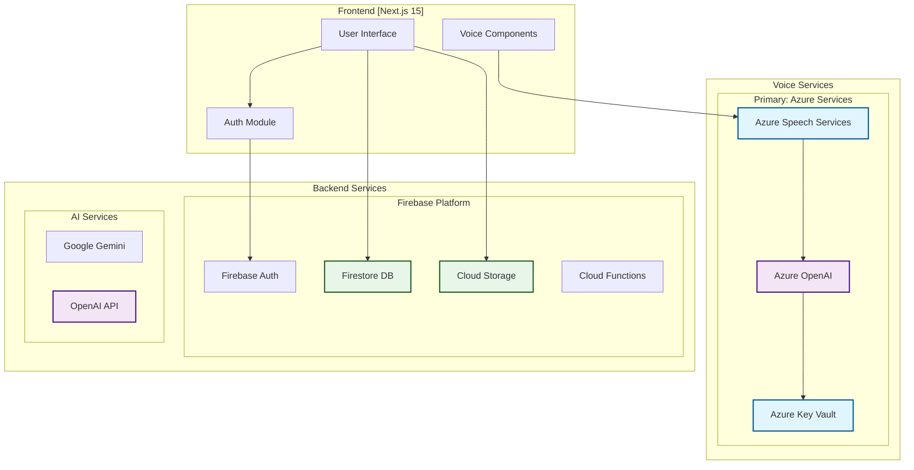

# PrepBettr - AI-Powered Interview Preparation Platform

A comprehensive interview preparation platform powered by Next.js, Firebase, Azure Speech Services, and OpenAI.

## 🏗️ System Architecture



## 🚀 Getting Started

### Prerequisites

- Node.js 20.x or later
- npm/yarn/pnpm
- Azure account with Speech Services and OpenAI deployments
- Firebase project with Auth, Firestore, and Storage enabled

### Installation

1. Clone the repository:
```bash
git clone https://github.com/yourusername/prepbettr.git
cd prepbettr
```

2. Install dependencies:
```bash
npm install
```

3. Set up environment variables (see Environment Configuration below)

4. Run the development server:
```bash
npm run dev
```

Open [http://localhost:3000](http://localhost:3000) to see the application.

## 🔧 Environment Configuration

### Required Azure Services

1. **Azure Speech Services**
   - Create a Speech resource in Azure Portal
   - Note the key and endpoint

2. **Azure OpenAI**
   - Deploy a GPT model (e.g., gpt-4o-mini)
   - Note the deployment name, key, and endpoint

3. **Azure Key Vault** (Optional but recommended)
   - Create a Key Vault for secure secret management
   - Store all sensitive keys

### Environment Variables

Create a `.env.local` file with the following variables:

```bash
# Azure Speech Services (Required)
NEXT_PUBLIC_SPEECH_KEY=your_speech_service_key
NEXT_PUBLIC_SPEECH_ENDPOINT=https://your-region.api.cognitive.microsoft.com
NEXT_PUBLIC_SPEECH_REGION=your-region

# Azure OpenAI (Required)
AZURE_OPENAI_KEY=your_azure_openai_key
AZURE_OPENAI_ENDPOINT=https://your-resource.openai.azure.com
AZURE_OPENAI_DEPLOYMENT=your-deployment-name
NEXT_PUBLIC_AZURE_OPENAI_API_KEY=your_azure_openai_key
NEXT_PUBLIC_AZURE_OPENAI_ENDPOINT=https://your-resource.openai.azure.com

# Azure Key Vault (Optional - for production)
AZURE_KEY_VAULT_URI=https://your-keyvault.vault.azure.net/
AZURE_TENANT_ID=your-tenant-id
AZURE_CLIENT_ID=your-client-id
AZURE_CLIENT_SECRET=your-client-secret

# Firebase Configuration
NEXT_PUBLIC_FIREBASE_API_KEY=your_firebase_api_key
NEXT_PUBLIC_FIREBASE_AUTH_DOMAIN=your-project.firebaseapp.com
NEXT_PUBLIC_FIREBASE_PROJECT_ID=your-project-id
NEXT_PUBLIC_FIREBASE_STORAGE_BUCKET=your-project.appspot.com
NEXT_PUBLIC_FIREBASE_MESSAGING_SENDER_ID=your_sender_id
NEXT_PUBLIC_FIREBASE_APP_ID=your_app_id


# Application Settings
NEXT_PUBLIC_APP_URL=http://localhost:3000
NODE_ENV=development
```

## Authentication Flow

### Current Flow
- **Server-side**: The server initially verifies the cookie received from the client.
- **Middleware Processing**: After cookie verification, the request is processed through a series of middleware.
- **Layout Application**: Finally, the layout is applied based on the authenticated status.

### SSL/gRPC Compatibility Issue

**Problem**: Firebase Admin SDK has compatibility issues with Node.js 18+ and OpenSSL 3.x, causing the error:
```
2 UNKNOWN: Getting metadata from plugin failed with error: error:1E08010C:DECODER routines::unsupported
```

**Current Solution**: The authentication system uses a robust fallback mechanism:
1. **Primary**: Attempts Firebase Admin SDK verification (fails due to SSL issue)
2. **Fallback**: Uses Firebase REST API verification (maintains security)
3. **Validation**: Performs additional token claims validation

**Implementation**: 
- `lib/services/firebase-verification.ts` handles the fallback logic
- Authentication remains secure through REST API verification
- Session cookies created when possible, otherwise ID tokens are used

### Attempted Fixes

✅ **Environment Variables**:
```bash
NODE_OPTIONS="--openssl-legacy-provider"
GRPC_SSL_CIPHER_SUITES="ECDHE-RSA-AES128-GCM-SHA256:ECDHE-RSA-AES256-GCM-SHA384"
GRPC_VERBOSITY="ERROR"
FIRESTORE_PREFER_REST="true"
```

✅ **Node.js Version**: Updated to v20.19.4 (recommended)

✅ **gRPC Configuration**: Set environment variables to prefer REST transport

❌ **Still Failing**: The OpenSSL/gRPC issue persists in the current Firebase Admin SDK version

### Future Resolution

**When fixed**: Once Google/Firebase resolves the OpenSSL 3.x compatibility:
1. Remove the fallback logic in `firebase-verification.ts`
2. Restore direct Firebase Admin SDK usage
3. Enable full session cookie functionality

**Alternative Solutions**:
- Wait for Firebase Admin SDK update
- Use Docker with older OpenSSL version
- Downgrade to Node.js 16 (not recommended)

**Current Status**: ✅ **Fully Functional** - Authentication works reliably with REST API fallback

## 🎙️ Voice Interview System

### Architecture Overview

The voice interview system uses Azure services exclusively for enterprise-grade reliability:

```
┌─────────────────────────────────────────────┐
│           Voice Interview Flow              │
├─────────────────────────────────────────────┤
│                                             │
│  1. User Initiates Interview               │
│           ↓                                 │
│  2. Azure Speech Services                  │
│      ├── Speech-to-Text (STT)              │
│      ├── Real-time audio processing        │
│      └── High-accuracy transcription       │
│           ↓                                 │
│  3. Azure OpenAI Processing               │
│      ├── GPT-4 conversation handling       │
│      ├── Context-aware responses           │
│      └── Interview question generation     │
│           ↓                                 │
│  4. Azure Text-to-Speech                  │
│      ├── Neural voice synthesis            │
│      ├── Natural speech patterns           │
│      └── Real-time audio streaming         │
│           ↓                                 │
│  5. Interview Session Management           │
│      ├── Question flow control             │
│      ├── Response recording & analysis     │
│      └── Transcript generation & storage   │
│                                             │
└─────────────────────────────────────────────┘
```

### Provider Configuration

#### Primary: Azure Speech Services + Azure OpenAI
- **Speech Recognition**: Azure Cognitive Services Speech SDK
- **AI Processing**: Azure OpenAI (GPT-4o-mini or GPT-4)
- **Speech Synthesis**: Azure Neural TTS voices
- **Latency**: < 500ms typical response time
- **Cost**: Pay-per-use based on Azure pricing

#### Azure Text-to-Speech
- **Neural Voices**: High-quality, natural-sounding speech synthesis
- **Voice Selection**: Multiple voice options (Jenny, Davis, Aria, etc.)
- **SSML Support**: Speech Synthesis Markup Language for fine control
- **Real-time Streaming**: Low-latency audio generation

### Dynamic Variables

| Variable | Description | Usage |
|----------|-------------|--------|
| `{{candidateName}}` | User's first name | Personalized greetings |
| `{{questions}}` | Interview questions list | Dynamic question flow |
| `{{jobRole}}` | Target position | Context-aware responses |
| `{{companyName}}` | Target company | Company-specific preparation |

### Implementation Files

```
azure/
├── lib/
│   ├── azure-config.ts          # Azure service configuration
│   ├── services/
│   │   ├── azure-speech-service.ts   # Speech SDK integration
│   │   └── azure-openai-service.ts   # OpenAI integration
│   └── test/
│       └── azure-services-health.test.ts
components/
├── Agent.tsx                     # Main voice interview component
├── VoiceInterviewUI.tsx         # UI controls for voice session
└── TranscriptDisplay.tsx        # Real-time transcript viewer
```

## 🔐 Authentication & Session Management

## 🚢 Deployment

### Azure App Service Deployment

#### Prerequisites
1. Azure subscription with App Service plan
2. Azure CLI installed and configured
3. All required Azure services provisioned

#### Deployment Steps

1. **Build the application**:
```bash
npm run build
```

2. **Create deployment package**:
```bash
zip -r deploy.zip . -x "*.git*" "node_modules/*" "*.env*"
```

3. **Deploy to staging slot**:
```bash
az webapp deployment source config-zip \
  --resource-group your-rg \
  --name your-app-name \
  --slot staging \
  --src deploy.zip
```

4. **Run smoke tests**:
```bash
npm run test:e2e:prod
```

5. **Swap to production**:
```bash
az webapp deployment slot swap \
  --resource-group your-rg \
  --name your-app-name \
  --slot staging \
  --target-slot production
```

### Azure Static Web Apps (Alternative)

For preview environments and static hosting:

1. **Create Azure Static Web App**:
```bash
az staticwebapp create \
  --name "prepbettr" \
  --resource-group "your-rg" \
  --source "https://github.com/yourusername/prepbettr" \
  --location "Central US" \
  --branch "main" \
  --app-location "/" \
  --api-location "api" \
  --output-location "out"
```

2. Configure environment variables in Azure Portal
3. Deploy automatically via GitHub Actions integration

### Docker Deployment

```dockerfile
# Dockerfile
FROM node:20-alpine AS builder
WORKDIR /app
COPY package*.json ./
RUN npm ci
COPY . .
RUN npm run build

FROM node:20-alpine
WORKDIR /app
COPY --from=builder /app/.next ./.next
COPY --from=builder /app/public ./public
COPY --from=builder /app/package*.json ./
RUN npm ci --production
EXPOSE 3000
CMD ["npm", "start"]
```

## 🔐 Production Deployment & Management

### How to Add New Secrets to Key Vault

1. **Using Azure CLI**:
```bash
# Set a new secret
az keyvault secret set \
  --vault-name "your-keyvault-name" \
  --name "SECRET_NAME" \
  --value "secret-value"

# Verify the secret was added
az keyvault secret show \
  --vault-name "your-keyvault-name" \
  --name "SECRET_NAME" \
  --query "value" -o tsv
```

2. **Using Azure Portal**:
   - Navigate to your Key Vault in Azure Portal
   - Go to "Secrets" section
   - Click "+ Generate/Import"
   - Enter the secret name and value
   - Set expiration date if needed
   - Click "Create"

3. **Update Application Configuration**:
```typescript
// Add to azure-config.ts
export const getSecretFromKeyVault = async (secretName: string) => {
  const credential = new DefaultAzureCredential();
  const vaultUrl = process.env.AZURE_KEY_VAULT_URI;
  const client = new SecretClient(vaultUrl, credential);
  
  try {
    const secret = await client.getSecret(secretName);
    return secret.value;
  } catch (error) {
    console.error(`Failed to retrieve secret ${secretName}:`, error);
    throw error;
  }
};
```

4. **Grant Access Permissions**:
```bash
# For App Service Managed Identity
az keyvault set-policy \
  --name "your-keyvault-name" \
  --object-id "managed-identity-object-id" \
  --secret-permissions get list

# For Service Principal
az keyvault set-policy \
  --name "your-keyvault-name" \
  --spn "service-principal-id" \
  --secret-permissions get list
```

### Promoting a Preview to Production

#### For Azure Static Web Apps (SWA)

1. **Verify Preview Environment**:
```bash
# Test the preview environment
curl -I https://your-app-preview.azurestaticapps.net/api/health

# Run smoke tests against preview
npm run test:e2e -- --baseUrl=https://your-app-preview.azurestaticapps.net
```

2. **Promote via Azure CLI**:
```bash
# Get the preview build ID
az staticwebapp environment list \
  --name "your-swa-name" \
  --resource-group "your-resource-group"

# Promote specific build to production
az staticwebapp environment set \
  --name "your-swa-name" \
  --resource-group "your-resource-group" \
  --environment-name "default" \
  --source "preview-build-id"
```

3. **Promote via GitHub Actions**:
```yaml
# .github/workflows/promote-to-prod.yml
name: Promote to Production
on:
  workflow_dispatch:
    inputs:
      preview_build_id:
        description: 'Preview build ID to promote'
        required: true
        type: string

jobs:
  promote:
    runs-on: ubuntu-latest
    steps:
      - name: Promote to Production
        uses: Azure/static-web-apps-deploy@v1
        with:
          azure_static_web_apps_api_token: ${{ secrets.AZURE_STATIC_WEB_APPS_API_TOKEN }}
          action: 'promote'
          build_id: ${{ github.event.inputs.preview_build_id }}
```

4. **Post-Promotion Verification**:
```bash
# Verify production deployment
curl -I https://your-app.azurestaticapps.net/api/health

# Run full test suite against production
npm run test:e2e:prod

# Check application insights for errors
az monitor app-insights query \
  --app "your-app-insights" \
  --analytics-query "exceptions | where timestamp > ago(10m)"
```

#### For Azure App Service

1. **Swap Deployment Slots**:
```bash
# Warm up the staging slot
az webapp deployment slot swap \
  --resource-group "your-resource-group" \
  --name "your-app-name" \
  --slot "staging" \
  --target-slot "production" \
  --action "swap"
```

2. **Gradual Traffic Routing**:
```bash
# Route 10% traffic to staging for testing
az webapp traffic-routing set \
  --resource-group "your-resource-group" \
  --name "your-app-name" \
  --distribution staging=10

# After validation, route 100% to production
az webapp traffic-routing set \
  --resource-group "your-resource-group" \
  --name "your-app-name" \
  --distribution production=100
```

### Rollback: Redeploy Previous SWA Build via GitHub UI

#### Option 1: Via GitHub Actions UI

1. **Navigate to GitHub Repository**:
   - Go to your repository on GitHub
   - Click on "Actions" tab
   - Find the "Deploy to Azure Static Web Apps" workflow

2. **Identify Previous Successful Build**:
   - Look for the last successful deployment before the issue
   - Note the commit SHA and build details
   - Click on the successful workflow run

3. **Re-run Previous Build**:
   - Click "Re-run all jobs" on the successful workflow
   - This will redeploy the exact same build to production
   - Monitor the deployment progress in the Actions tab

#### Option 2: Via Azure Portal

1. **Access Static Web App**:
   - Login to Azure Portal
   - Navigate to your Static Web App resource
   - Go to "Deployment history" section

2. **Select Previous Build**:
   - Find the stable build you want to rollback to
   - Click on the build entry
   - Click "Activate" to make it the active production build

3. **Verify Rollback**:
```bash
# Check if the rollback was successful
curl -I https://your-app.azurestaticapps.net

# Verify specific functionality
npm run test:smoke -- --baseUrl=https://your-app.azurestaticapps.net
```

#### Option 3: Emergency Rollback via Git

1. **Revert to Previous Commit**:
```bash
# Create a revert commit
git revert HEAD --no-edit

# Or revert to specific commit
git revert abc1234 --no-edit

# Push the revert
git push origin main
```

2. **Force Deploy Specific Commit**:
```bash
# Checkout previous stable commit
git checkout abc1234

# Create a new branch and force push
git checkout -b emergency-rollback
git push origin emergency-rollback

# Merge to main to trigger deployment
git checkout main
git merge emergency-rollback
git push origin main
```

#### Rollback Checklist

- [ ] **Identify the issue**: Document what caused the need for rollback
- [ ] **Verify previous stable build**: Ensure the target build was working correctly
- [ ] **Backup current state**: Take snapshots of current configuration if needed
- [ ] **Execute rollback**: Use one of the methods above
- [ ] **Test functionality**: Run smoke tests on rolled-back version
- [ ] **Update monitoring**: Check that all monitoring and alerts are working
- [ ] **Communicate status**: Notify stakeholders of the rollback completion
- [ ] **Plan fix**: Create action plan to address the original issue

#### Post-Rollback Actions

1. **Monitor Application Health**:
```bash
# Check health endpoints
curl https://your-app.azurestaticapps.net/api/health

# Monitor error rates
az monitor app-insights query \
  --app "your-app-insights" \
  --analytics-query "requests | where timestamp > ago(30m) | summarize ErrorRate = (countif(success == false) * 100.0) / count() by bin(timestamp, 5m)"
```

2. **Validate Core Features**:
   - User authentication flow
   - Voice interview functionality  
   - Resume upload and processing

3. **Root Cause Analysis**:
   - Review deployment logs
   - Analyze what changed between stable and failed builds
   - Document lessons learned
   - Update deployment process to prevent similar issues

## 🔍 Troubleshooting

### Common Issues and Solutions

#### 1. Azure Speech Services Connection Issues

**Problem**: "Failed to initialize speech recognizer"

**Solution**:
- Verify Speech Service key and endpoint in environment variables
- Check Azure service region matches configuration
- Ensure firewall allows WebSocket connections to Azure
- Test with Azure Speech SDK diagnostic tool:
```bash
npm run test:azure-health
```

#### 2. OpenAI Rate Limiting

**Problem**: "429 Too Many Requests" errors

**Solution**:
- Implement exponential backoff in `azure-openai-service.ts`
- Increase Azure OpenAI quota in Azure Portal
- Use multiple deployments for load balancing
- Configure retry logic:
```typescript
const retryConfig = {
  maxRetries: 3,
  retryDelay: 1000,
  maxRetryDelay: 5000
};
```

#### 3. Firebase Authentication Issues

**Problem**: SSL/gRPC compatibility errors with Node.js 18+

**Solution**:
- REST API fallback is automatically enabled
- For production, use environment variables:
```bash
FIRESTORE_PREFER_REST="true"
GRPC_VERBOSITY="ERROR"
NODE_OPTIONS="--openssl-legacy-provider"
```

#### 4. Voice Interview Latency

**Problem**: Slow response times during voice interviews

**Solution**:
- Use Azure region closest to users
- Enable Azure CDN for static assets
- Optimize audio buffer sizes:
```javascript
const audioConfig = {
  bufferSize: 4096,
  sampleRate: 16000,
  enableAudioOptimization: true
};
```

#### 5. Key Vault Access Denied

**Problem**: "Access denied to Azure Key Vault"

**Solution**:
1. Grant app service managed identity access:
```bash
az keyvault set-policy --name your-keyvault \
  --object-id <managed-identity-object-id> \
  --secret-permissions get list
```
2. Enable system-assigned managed identity on App Service
3. Verify Key Vault firewall rules

### Health Check Endpoints

- `/api/health` - Overall system health
- `/api/health/azure` - Azure services status
- `/api/health/firebase` - Firebase connectivity
- `/api/health/voice` - Voice services availability

### Logging and Monitoring

1. **Application Insights** (Azure):
   - Real-time performance metrics
   - Error tracking and alerts
   - User session analytics

2. **Firebase Analytics**:
   - User engagement metrics
   - Conversion tracking
   - Custom events

3. **Custom Logging**:
   ```typescript
   import { logger } from '@/lib/logger';
   
   logger.info('Voice session started', {
     userId,
     provider: 'azure',
     timestamp: Date.now()
   });
   ```

## 📚 Additional Resources

- [Azure Speech Services Documentation](https://docs.microsoft.com/azure/cognitive-services/speech-service/)
- [Azure OpenAI Documentation](https://learn.microsoft.com/azure/ai-services/openai/)
- [Firebase Documentation](https://firebase.google.com/docs)
- [Next.js Documentation](https://nextjs.org/docs)

## 📝 License

This project is proprietary software. All rights reserved.

## 🤝 Support

For issues and questions:
- Create an issue in the GitHub repository
- Contact support at support@prepbettr.com
- Check the [troubleshooting guide](#-troubleshooting) above
