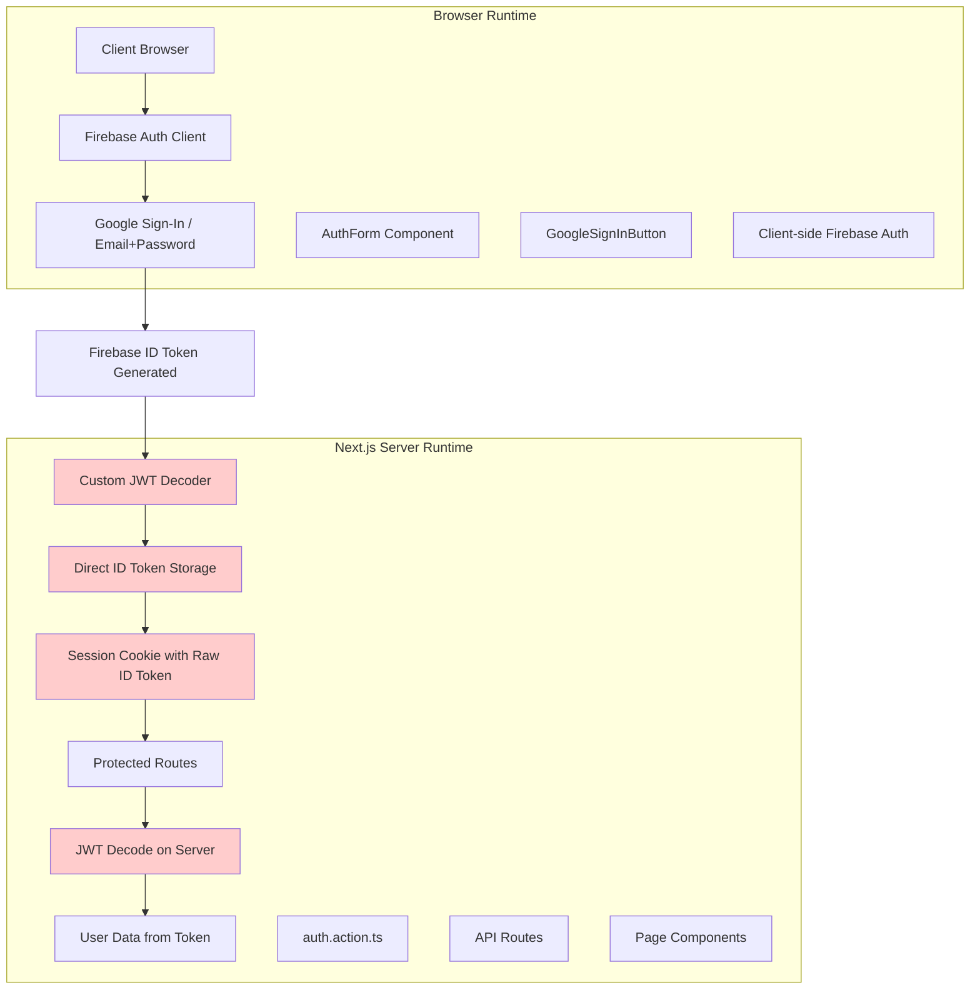

# PrepBettr Authentication Migration Analysis
## From Firebase-Admin Server Verification to Client-side ID-token Trust

### Overview
This document inventories every PrepBettr request path that **formerly relied on Firebase-Admin server verification** and now relies on **client-side ID-token trust** due to SSL/gRPC connectivity issues with Firebase Admin SDK.

---

## Authentication Flow Diagram



---

## Request Path Analysis Table

| **Endpoint/Component** | **Type** | **Former Approach (Firebase-Admin)** | **Current Approach (Client ID-token)** | **Runtime Location** | **Security Change** |
|------------------------|----------|---------------------------------------|----------------------------------------|---------------------|-------------------|
| `/api/auth/signin` | API Route | `admin.auth().verifyIdToken()` → `admin.auth().createSessionCookie()` | Direct ID token storage in session cookie | Next.js Server | ⚠️ **Degraded** - No server verification |
| `/api/auth/signout` | API Route | `admin.auth().revokeRefreshTokens()` + cookie deletion | Cookie deletion only | Next.js Server | ⚠️ **Degraded** - No token revocation |
| `/api/auth/signup` | API Route | `admin.auth().verifyIdToken()` + Firestore write | **Still uses Firebase Admin** (mixed approach) | Next.js Server | ✅ **Maintained** - Server verification |
| `lib/actions/auth.action.ts::signIn()` | Server Action | Firebase Admin session cookie creation | Custom JWT decode + direct token storage | Next.js Server | ⚠️ **Degraded** - Client-side trust |
| `lib/actions/auth.action.ts::getCurrentUser()` | Server Action | `admin.auth().verifySessionCookie()` | `decodeFirebaseToken()` (custom decoder) | Next.js Server | ⚠️ **Degraded** - No cryptographic verification |
| `lib/actions/auth.action.ts::setSessionCookie()` | Server Action | `admin.auth().createSessionCookie(idToken)` | Direct ID token storage | Next.js Server | ⚠️ **Degraded** - Raw token storage |
| `/api/profile/me` | API Route | Session cookie → Admin verification → User data | Session cookie → JWT decode → Token data | Next.js Server | ⚠️ **Degraded** - Trust client token |
| `/api/profile/update` | API Route | `admin.auth().verifyIdToken(idToken)` | **Still uses Firebase Admin** (mixed approach) | Next.js Server | ✅ **Maintained** - Server verification |
| `/api/upload-profile-pic` | API Route | Firebase Admin token verification | **Mixed approach** - some paths still use Admin | Next.js Server | 🔄 **Mixed** |
| `components/AuthForm.tsx` | Client Component | Firebase Auth → ID token → Server verification | Firebase Auth → ID token → **Trusted directly** | Browser | ⚠️ **Same risk** - Client-side token generation |
| `components/GoogleSignInButton.tsx` | Client Component | Firebase Auth → ID token → Server verification | Firebase Auth → ID token → **Trusted directly** | Browser | ⚠️ **Same risk** - Client-side token generation |
| `app/dashboard/layout.tsx` | Layout Component | `isAuthenticated()` → Admin session verification | `isAuthenticated()` → **JWT decode verification** | Next.js Server | ⚠️ **Degraded** - No server verification |
| Dashboard Pages (`/dashboard/*`) | Page Components | `getCurrentUser()` → Admin verification | `getCurrentUser()` → **JWT decode** | Next.js Server | ⚠️ **Degraded** - Trust token claims |
| Session Cookie Management | Server-side | Firebase Admin session cookies (cryptographically secure) | **Raw ID tokens** stored as cookies | Next.js Server | ⚠️ **Significantly degraded** - No server-side validation |

---

## Runtime Distribution Analysis

### **Browser Runtime Components**
- `components/AuthForm.tsx` - Email/password and form handling
- `components/GoogleSignInButton.tsx` - Google OAuth popup
- `firebase/client.ts` - Firebase client SDK initialization
- All client-side authentication state management

### **Next.js Server Runtime Components**
- `lib/actions/auth.action.ts` - Core authentication server actions
- **Note**: `lib/utils/jwt-decoder.ts` - **Custom JWT decoder** has been moved to `__trash__/utils/jwt-decoder.ts`
- `firebase/admin.ts` - Firebase Admin SDK (partially disabled due to SSL issues)
- All `/api/auth/*` routes - Authentication API endpoints
- All `/api/profile/*` routes - Profile management
- Dashboard layout and page authentication guards

---

## Critical Security Changes

### **What Changed:**
1. **Session Cookie Creation**: Firebase Admin's cryptographically secure session cookies → Raw ID tokens stored directly
2. **Token Verification**: Server-side Firebase Admin verification → Client-side JWT decoding
3. **Session Management**: Firebase's built-in session revocation → Manual cookie deletion only
4. **Trust Model**: Server verifies all tokens → Server trusts client-provided tokens

### **What Remained the Same:**
1. **Initial Token Generation**: Still uses official Firebase Auth client SDK
2. **Some Endpoints**: `/api/auth/signup` and `/api/profile/update` still use Firebase Admin (mixed approach)
3. **Client-side Flow**: No changes to user authentication experience

### **Security Implications:**
- ⚠️ **Token Tampering**: Server no longer cryptographically verifies tokens
- ⚠️ **Session Hijacking**: Raw ID tokens in cookies are more vulnerable
- ⚠️ **No Server-side Revocation**: Cannot invalidate sessions from server
- ⚠️ **Extended Attack Surface**: Client-side trust increases attack vectors

---

## Code Evidence

### Before (Firebase Admin - Commented/Disabled):
```typescript
// From lib/actions/auth.action.ts (line 16-17)
// Skip creating a session cookie with the Firebase Admin SDK
// Just use the ID token directly

// From app/api/auth/signin/route.ts (line 19-21)  
// Since Firebase Admin has SSL issues, we'll trust the client-side verification
// and store the token directly. This is acceptable for development/testing.
```

### After (Client-side Trust):
```typescript
// From __trash__/utils/jwt-decoder.ts (moved from lib/utils/jwt-decoder.ts)
export function decodeFirebaseToken(token: string): DecodedToken | null {
  // Split the token into parts and decode payload
  // Basic validation - no cryptographic verification
}

// From lib/actions/auth.action.ts (line 60-68)
const decodedToken = decodeFirebaseToken(idToken);
if (!decodedToken) {
    return { success: false, message: "Invalid authentication token" };
}
```

### Mixed Approach Examples:
```typescript
// From app/api/auth/signup/route.ts (line 16) - Still uses Admin
const decodedToken = await auth.verifyIdToken(idToken);

// From app/api/profile/update/route.ts (line 48) - Still uses Admin  
const decodedToken = await adminAuth.verifyIdToken(idToken);
```

---

## Recommendations

1. **Fix Firebase Admin SSL Issues**: Resolve the root cause rather than bypassing security
2. **Implement Proper Session Management**: Use Firebase Admin's session cookies for security
3. **Add Server-side Token Validation**: Restore cryptographic verification
4. **Audit Mixed Approach**: Standardize authentication across all endpoints
5. **Monitor for Token Abuse**: Implement logging and anomaly detection
