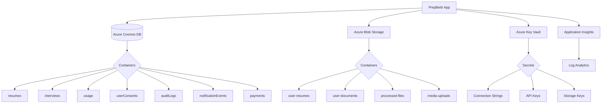

# PrepBettr Infrastructure

This directory contains the Infrastructure as Code (IaC) templates and deployment scripts for PrepBettr's Azure-based infrastructure.

## Overview

PrepBettr uses Azure cloud services for data storage and processing, with the following key components:

- **Azure Cosmos DB** - Primary document database for user data, interviews, usage tracking
- **Azure Blob Storage** - File storage for resumes, documents, processed files, media
- **Azure Key Vault** - Secure secret and configuration management
- **Azure Application Insights** - Application monitoring and telemetry
- **Azure Log Analytics** - Centralized logging and analysis

## Architecture



## Directory Structure

```
infrastructure/
├── azure/
│   ├── main.bicep                      # Main Bicep template
│   ├── main.parameters.dev.json        # Development environment parameters
│   ├── main.parameters.prod.json       # Production environment parameters
│   ├── deploy.sh                       # Deployment script
│   └── outputs-*.json                  # Deployment outputs (generated)
└── README.md                           # This file
```

## Environment Configuration

### Development Environment
- **Cosmos DB**: Serverless tier with free tier enabled
- **Storage**: Standard LRS replication
- **Backup**: Local redundancy, 7-day retention
- **Lifecycle**: 30-day archive, 1-year deletion

### Production Environment
- **Cosmos DB**: Provisioned throughput (1000-10000 RU/s) with multi-region
- **Storage**: Standard GRS replication
- **Backup**: Geo-redundant, 30-day retention
- **Lifecycle**: 90-day archive, 7-year retention
- **Monitoring**: Enhanced with alerts and dashboards

## Prerequisites

Before deploying infrastructure, ensure you have:

1. **Azure CLI** installed and configured
   ```bash
   az --version
   az login
   ```

2. **Bicep CLI** (automatically installed by deployment script)
   ```bash
   az bicep version
   ```

3. **Proper Azure permissions**:
   - `Owner` or `Contributor` role on the target subscription
   - `User Access Administrator` for RBAC assignments
   - `Key Vault Contributor` for secret management

4. **Required environment variables** (for CI/CD):
   ```bash
   AZURE_CLIENT_ID=<service-principal-id>
   AZURE_TENANT_ID=<tenant-id>
   AZURE_SUBSCRIPTION_ID=<subscription-id>
   ```

## Deployment

### Local Deployment

1. **Validate templates**:
   ```bash
   npm run infra:validate
   ```

2. **Preview changes** (dry run):
   ```bash
   npm run infra:plan
   ```

3. **Deploy to development**:
   ```bash
   npm run infra:deploy:dev
   ```

4. **Deploy to production** (requires confirmation):
   ```bash
   npm run infra:deploy:prod
   ```

### Manual Deployment

You can also use the deployment script directly:

```bash
cd infrastructure/azure

# Development environment
./deploy.sh dev

# Staging environment
./deploy.sh staging

# Production environment (requires explicit confirmation)
./deploy.sh prod

# Dry run to preview changes
./deploy.sh dev --dry-run

# Validate templates only
./deploy.sh dev --validate

# Force deployment without prompts
./deploy.sh dev --force

# Custom subscription and location
./deploy.sh prod --subscription 12345678-1234-1234-1234-123456789012 --location "East US"
```

### CI/CD Deployment

The infrastructure is automatically deployed via GitHub Actions:

- **Development**: Triggered on pushes to feature branches affecting infrastructure
- **Staging**: Triggered on pushes to `develop` branch
- **Production**: Triggered on pushes to `main` branch

Workflow file: `.github/workflows/infrastructure.yml`

## Post-Deployment Configuration

After successful deployment:

1. **Update application configuration**:
   ```bash
   # Get deployment outputs
   npm run infra:outputs
   
   # Update environment variables with new endpoints
   AZURE_COSMOS_ENDPOINT=<cosmos-endpoint>
   AZURE_STORAGE_ACCOUNT_NAME=<storage-account-name>
   AZURE_KEY_VAULT_URI=<key-vault-uri>
   ```

2. **Verify connectivity**:
   ```bash
   # Test Azure services health
   npm run health:azure
   
   # Test specific services
   npm run test:azure-health
   ```

3. **Configure application secrets in Key Vault**:
   - Firebase configuration
   - SendGrid API keys
   - External API keys
   - Encryption keys

## Resource Naming Convention

Resources follow a consistent naming pattern:

```
Format: <project>-<environment>-<resource-type>
Production: prepbettr-<resource-type>
Development: prepbettr-dev-<resource-type>
Staging: prepbettr-staging-<resource-type>
```

Examples:
- `prepbettr-cosmos` (production Cosmos DB)
- `prepbettr-dev-kv` (development Key Vault)
- `prepbettr-staging-storage` (staging storage account)

## Security Configuration

### Access Control

1. **Managed Identity**: Resources use system-assigned managed identities for authentication
2. **RBAC**: Role-based access control configured automatically
3. **Network Security**: Private endpoints can be enabled for production
4. **Encryption**: All data encrypted at rest and in transit

### Key Vault Secrets

The following secrets are automatically created:

| Secret Name | Purpose |
|-------------|---------|
| `cosmos-connection-string` | Cosmos DB connection string |
| `storage-connection-string` | Storage account connection string |
| `storage-account-name` | Storage account name |
| `storage-account-key` | Storage account primary key |
| `application-insights-connection-string` | Application Insights connection |

### RBAC Assignments

Automatic role assignments:
- Cosmos DB: `DocumentDB Account Contributor` for application identity
- Storage: `Storage Blob Data Contributor` for application identity
- Key Vault: `Key Vault Secrets User` for application identity

## Data Migration Strategy

For migrating from Firebase to Azure:

1. **Dual-write period**: Application writes to both Firebase and Azure
2. **Background migration**: Batch migration of historical data
3. **Data validation**: Verify data consistency between systems
4. **Cut-over**: Switch reads to Azure, stop writes to Firebase
5. **Cleanup**: Remove Firebase dependencies after validation

See the main README for detailed migration procedures.

## Monitoring and Alerts

### Application Insights

Monitors:
- Request/response metrics
- Dependency call success rates
- Exception tracking
- Custom telemetry

### Resource Monitoring

Key metrics tracked:
- **Cosmos DB**: Request units consumed, throttling, latency
- **Storage**: Transaction counts, blob operations, capacity
- **Key Vault**: Secret access patterns, authentication failures

### Alerts

Production alerts configured for:
- High Cosmos DB consumption (>80% RU/s)
- Storage account errors (>5% error rate)
- Key Vault access denied events
- Application exceptions (>10/minute)

## Cost Management

### Development Environment
- Free tier Cosmos DB (1000 RU/s, 25 GB)
- LRS storage (minimal replication costs)
- Standard Key Vault tier

**Estimated monthly cost**: $10-30

### Production Environment
- Provisioned Cosmos DB (1000-10000 RU/s)
- GRS storage with lifecycle policies
- Premium Key Vault tier (optional)

**Estimated monthly cost**: $100-500 (depending on usage)

### Cost Optimization

1. **Lifecycle Policies**: Automatically tier old data to cool/archive storage
2. **Serverless Options**: Consider serverless Cosmos DB for variable workloads
3. **Reserved Capacity**: Purchase reserved instances for predictable workloads
4. **Monitoring**: Use Azure Cost Management for budget alerts

## Troubleshooting

### Common Issues

#### 1. Deployment Failures

```bash
# Check deployment logs
az deployment group list --resource-group rg-prepbettr-dev --output table

# Get deployment details
az deployment group show --resource-group rg-prepbettr-dev --name <deployment-name>
```

#### 2. Access Issues

```bash
# Check RBAC assignments
az role assignment list --scope /subscriptions/<subscription-id>/resourceGroups/rg-prepbettr-dev

# Test Key Vault access
az keyvault secret list --vault-name prepbettr-dev-kv
```

#### 3. Connectivity Problems

```bash
# Test Cosmos DB connection
az cosmosdb show --resource-group rg-prepbettr-dev --name prepbettr-dev-cosmos

# Test storage account
az storage account show --resource-group rg-prepbettr-dev --name prepbettrdevstorage
```

### Support Resources

- **Azure Documentation**: https://docs.microsoft.com/azure/
- **Bicep Reference**: https://docs.microsoft.com/azure/azure-resource-manager/bicep/
- **Cost Calculator**: https://azure.microsoft.com/pricing/calculator/
- **Support Tickets**: Azure Portal → Support → New Support Request

## Backup and Recovery

### Cosmos DB Backup

- **Automatic Backup**: Enabled with periodic backup policy
- **Retention**: 30 days (production), 7 days (development)
- **Point-in-time Recovery**: Available for production environments

### Storage Account Backup

- **Soft Delete**: Enabled for 30 days (production), 7 days (development)
- **Versioning**: Enabled for critical containers
- **Geo-replication**: GRS for production, LRS for development

### Key Vault Recovery

- **Soft Delete**: 90-day retention period
- **Purge Protection**: Enabled for production environments
- **Backup**: Secrets automatically backed up with the vault

### Recovery Procedures

1. **Cosmos DB Recovery**:
   ```bash
   # Contact Azure support for point-in-time recovery
   # Restore from automatic backups
   ```

2. **Storage Recovery**:
   ```bash
   # Undelete soft-deleted blobs
   az storage blob undelete --account-name <storage-account> --container-name <container> --name <blob>
   ```

3. **Key Vault Recovery**:
   ```bash
   # Recover soft-deleted vault
   az keyvault recover --name <vault-name> --resource-group <resource-group>
   
   # Recover soft-deleted secrets
   az keyvault secret recover --vault-name <vault-name> --name <secret-name>
   ```

## Contributing

When modifying infrastructure:

1. **Test changes** in development environment first
2. **Update parameters** for all environments as needed
3. **Document changes** in this README
4. **Create PR** with infrastructure changes for review
5. **Validate deployment** in CI/CD pipeline before merging

## Security Best Practices

1. **Never commit secrets** to version control
2. **Use managed identities** where possible
3. **Enable audit logging** for all resources
4. **Regularly rotate** access keys and secrets
5. **Monitor access patterns** for anomalies
6. **Follow principle of least privilege** for RBAC

## Questions and Support

For infrastructure-related questions:

1. Check this documentation first
2. Review Azure documentation for specific services
3. Check deployment logs and Azure portal for errors
4. Create an issue in the repository with detailed information
5. Contact the platform team for urgent issues

---

**Last Updated**: January 2025  
**Maintained By**: PrepBettr Platform Team