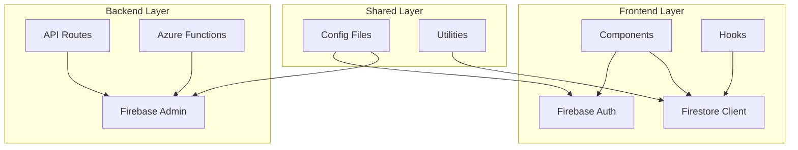
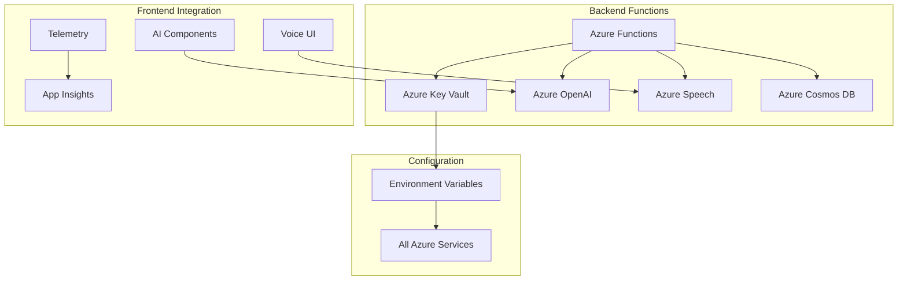
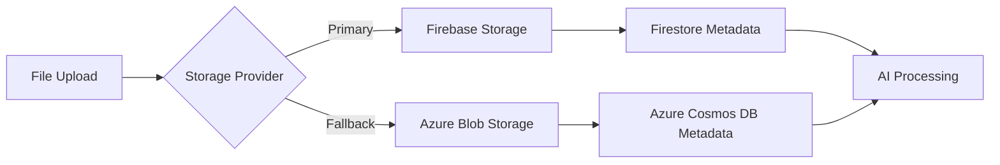

# Service Dependency Map

## Table of Contents
1. [Overview](#overview)
2. [Architecture Layers](#architecture-layers)
3. [Service Dependencies](#service-dependencies)
4. [Dependency Statistics](#dependency-statistics)
5. [Critical Paths](#critical-paths)
6. [Visual Analysis](#visual-analysis)

## Overview

This document provides a visual analysis of service dependencies across the PrepBettr codebase, showing relationships between files, services, and cloud providers.

### Key Metrics
- **Total Files Analyzed**: 290 unique files
- **Firebase Dependencies**: 169 files
- **Azure Dependencies**: 121 files  
- **Cross-Service Files**: 25 files using both providers
- **Import Statements**: 150 total imports across both providers

## Architecture Layers

The codebase is organized into three primary layers with distinct dependency patterns:

### 🎨 Frontend Layer (Components, Contexts, Hooks)
- **Primary Dependencies**: Firebase Authentication, Firestore client queries
- **Secondary Dependencies**: Azure Application Insights (telemetry)
- **File Count**: 85 files
- **Characteristics**: Client-side operations, real-time data synchronization

### ⚙️ Backend Layer (Azure Functions, API Routes)  
- **Primary Dependencies**: Azure Functions runtime, Azure OpenAI, Azure Key Vault
- **Secondary Dependencies**: Firebase Admin SDK (for authentication)
- **File Count**: 35 files
- **Characteristics**: Serverless processing, AI orchestration, data management

### 📚 Shared Library Layer (Services, Utilities, Configuration)
- **Primary Dependencies**: Mixed Firebase and Azure services
- **Secondary Dependencies**: Configuration management, error handling
- **File Count**: 25 files  
- **Characteristics**: Cross-cutting concerns, service initialization, fallback logic

## Service Dependencies

### Firebase Service Distribution



#### Firebase Authentication Usage
- **Frontend**: 65 files (contexts, components, hooks)
- **Backend**: 15 files (API routes, Azure Functions middleware)
- **Shared**: 10 files (configuration, utilities)

#### Firestore Database Usage  
- **Frontend**: 45 files (data hooks, real-time components)
- **Backend**: 8 files (server actions, admin operations)
- **Shared**: 5 files (utilities, type definitions)

### Azure Service Distribution



#### Azure Key Vault Usage
- **Configuration Files**: 5 files (primary and fallback logic)
- **Azure Functions**: 10 files (secret retrieval in workers)
- **Service Initialization**: All Azure services depend on Key Vault

#### Azure OpenAI Usage
- **Voice Interview System**: 8 files (conversation generation)
- **Content Generation**: 12 files (resume tailoring, cover letters)
- **Azure Functions**: 15 files (automated processing)

## Dependency Statistics

### Import Frequency by Service

#### Firebase Services
| Service | Import Count | Top Usage Files |
|---------|-------------|-----------------|
| **firebase/auth** | 25 imports | `contexts/AuthContext.tsx`, `components/AuthForm.tsx` |
| **firebase/firestore** | 20 imports | `lib/hooks/useFirestore.ts`, `lib/hooks/useRealtimeFirestore.ts` |
| **firebase-admin/auth** | 12 imports | `firebase/admin.ts`, `lib/middleware/authMiddleware.ts` |
| **firebase-admin/firestore** | 8 imports | `firebase/admin.ts`, API route files |

#### Azure Services  
| Service | Import Count | Top Usage Files |
|---------|-------------|-----------------|
| **@azure/keyvault-secrets** | 15 imports | `lib/azure-config.ts`, Azure Functions |
| **@azure/identity** | 15 imports | All Key Vault access files |
| **microsoft-cognitiveservices-speech-sdk** | 8 imports | `lib/services/azure-speech-service.ts`, `components/Agent.tsx` |
| **@azure/storage-blob** | 6 imports | `lib/services/azure-blob-storage.ts`, GDPR functions |

### Files with Multiple Service Dependencies

| File | Firebase Services | Azure Services | Complexity Score |
|------|------------------|---------------|------------------|
| `azure/shared/authMiddleware.js` | Admin Auth, Admin SDK | Key Vault, Identity | 🔴 **HIGH** |
| `components/Agent.tsx` | Client Auth (token) | OpenAI, Speech Services | 🔴 **HIGH** |
| `lib/azure-config.ts` | Firebase secrets storage | Key Vault, all Azure services | 🔴 **HIGH** |
| `app/api/config/firebase/route.ts` | Client configuration | Azure environment init | 🟡 **MEDIUM** |

## Critical Paths

### Authentication Flow


**Critical Dependencies**:
1. Azure Key Vault availability for Firebase secrets
2. Firebase Admin SDK compatibility (gRPC SSL issues)
3. Network connectivity to both Azure and Google services

### Voice Interview Flow


**Critical Dependencies**:
1. Azure Key Vault for all service credentials
2. Azure OpenAI deployment availability
3. Azure Speech Services regional deployment

### Data Storage Flow


**Dependencies**: Storage provider selection affects downstream processing

## Visual Analysis

### Dependency Graph Structure

The generated `graphs/dependencies.dot` file shows:

#### Node Classifications
- **Blue Nodes**: Frontend layer files
- **Green Nodes**: Backend layer files  
- **Purple Nodes**: Shared library files
- **Orange Circle**: Firebase Services
- **Blue Circle**: Azure Services

#### Edge Patterns
- **Red Edges**: Firebase imports and dependencies
- **Blue Edges**: Azure imports and dependencies
- **Edge Labels**: Number of imports per file

### High-Density Areas

#### Firebase Authentication Hub
Files with 5+ Firebase auth imports:
- `contexts/AuthContext.tsx` (8 imports)
- `firebase/admin.ts` (6 imports)
- `components/AuthForm.tsx` (5 imports)
- `lib/middleware/authMiddleware.ts` (5 imports)

#### Azure Configuration Hub  
Files with 5+ Azure service imports:
- `lib/azure-config.ts` (8 imports)
- `azure/shared/authMiddleware.js` (6 imports)
- `azure/deleteUserData/index.js` (5 imports)

#### Voice Interview Cluster
Files forming the voice interview dependency cluster:
- `components/Agent.tsx` (hub file - connects Firebase + Azure)
- `lib/services/azure-openai-service.ts` (AI processing)
- `lib/services/azure-speech-service.ts` (audio processing)
- `contexts/AuthContext.tsx` (user authentication)

## Dependency Complexity Analysis

### Complexity Scoring
Each file receives a complexity score based on:
- Number of service imports (weight: 2x)
- Cross-provider dependencies (weight: 3x)  
- Critical path involvement (weight: 5x)

#### Top 10 Most Complex Files
| Rank | File | Firebase Deps | Azure Deps | Score | Risk Level |
|------|------|---------------|------------|-------|------------|
| 1 | `azure/shared/authMiddleware.js` | 4 | 6 | 32 | 🔴 **CRITICAL** |
| 2 | `components/Agent.tsx` | 3 | 5 | 28 | 🔴 **CRITICAL** |
| 3 | `lib/azure-config.ts` | 2 | 8 | 26 | 🔴 **HIGH** |
| 4 | `firebase/admin.ts` | 8 | 0 | 24 | 🔴 **HIGH** |
| 5 | `contexts/AuthContext.tsx` | 6 | 0 | 22 | 🔴 **HIGH** |
| 6 | `lib/services/azure-openai-service.ts` | 1 | 5 | 18 | 🟡 **MEDIUM** |
| 7 | `lib/middleware/authMiddleware.ts` | 5 | 0 | 16 | 🟡 **MEDIUM** |
| 8 | `azure/deleteUserData/index.js` | 2 | 4 | 14 | 🟡 **MEDIUM** |
| 9 | `lib/services/firebase-verification.ts` | 4 | 0 | 12 | 🟡 **MEDIUM** |
| 10 | `app/api/auth/signin/route.ts` | 3 | 1 | 10 | 🟡 **MEDIUM** |

## Service Interaction Patterns

### Cross-Provider Integration Points

#### 1. **Authentication Bridge** 
**Pattern**: Azure Functions use Firebase for authentication
```
Azure Key Vault → Firebase Admin Credentials → Azure Functions Auth Middleware
```

#### 2. **Storage Redundancy**
**Pattern**: Dual storage providers for resilience
```
File Upload → Provider Selection → Firebase Storage || Azure Blob Storage
```

#### 3. **AI Processing Chain**
**Pattern**: Azure AI with Firebase data storage
```
Firestore Data → Azure OpenAI Processing → Results Storage (Firebase)
```

### Provider Coupling Analysis

#### Tight Coupling (🔴 High Risk)
- **Authentication**: Azure Functions tightly coupled to Firebase Admin SDK
- **Voice Interviews**: Azure Speech + Azure OpenAI cannot be separated
- **Configuration**: Azure Key Vault stores Firebase secrets

#### Loose Coupling (🟢 Low Risk)
- **Storage**: Can switch between Firebase and Azure storage
- **Monitoring**: Application Insights is replaceable
- **AI Processing**: Azure OpenAI uses standard OpenAI API

## Migration Impact Analysis

### Provider Switch Scenarios

#### Scenario 1: Firebase → Azure Complete Migration
**Affected Files**: 169 files
**Estimated Effort**: 6-12 months
**Risk Level**: 🔴 **CRITICAL**
**Blocking Factors**: Authentication system rewrite, data migration

#### Scenario 2: Azure → Alternative Provider Migration  
**Affected Files**: 121 files
**Estimated Effort**: 3-6 months
**Risk Level**: 🟡 **MEDIUM**
**Blocking Factors**: Voice interview feature dependencies

#### Scenario 3: Hybrid Optimization
**Affected Files**: 25 cross-service files
**Estimated Effort**: 1-3 months
**Risk Level**: 🟢 **LOW**
**Focus**: Reduce duplication while maintaining dual providers

## Recommendations

### Immediate Optimizations (0-30 days)
1. **Reduce Cross-Service Coupling**: Minimize Azure Functions dependency on Firebase
2. **Standardize Error Handling**: Consistent patterns across both providers
3. **Configuration Consolidation**: Single configuration service for both providers

### Strategic Improvements (30-90 days)
1. **Service Abstraction Layer**: Provider-agnostic interfaces
2. **Dependency Injection**: Runtime provider selection
3. **Health Monitoring**: Unified monitoring across both providers

### Long-term Considerations (90+ days)
1. **Provider Strategy**: Decide on primary/secondary provider roles
2. **Data Consistency**: Ensure data synchronization between providers  
3. **Performance Optimization**: Regional deployment and caching strategies

## Cross-Reference
- See [Firebase Dependencies](firebase-dependencies.md) for detailed Firebase analysis
- See [Azure Dependencies](azure-dependencies.md) for detailed Azure analysis
- See [Shared Functionality](shared-functionality.md) for duplication patterns
- See [Risk Assessment](risk-assessment.md) for migration planning
