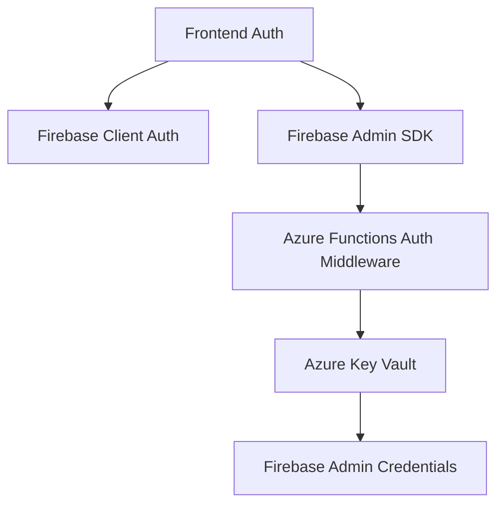
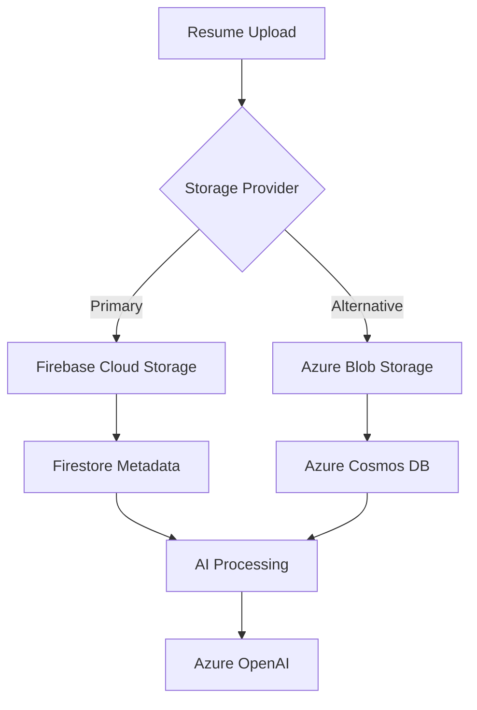

# Service Dependency Risk Assessment

## Table of Contents
1. [Executive Summary](#executive-summary)
2. [Firebase Services Risk Analysis](#firebase-services-risk-analysis)
3. [Azure Services Risk Analysis](#azure-services-risk-analysis)
4. [Cross-Service Dependencies](#cross-service-dependencies)
5. [Migration Risk Matrix](#migration-risk-matrix)
6. [Mitigation Strategies](#mitigation-strategies)

## Executive Summary

**Overall Risk Level**: 🟡 **MEDIUM-HIGH**

### Key Findings
- **169 files** depend on Firebase services across frontend, backend, and shared libraries
- **121 files** depend on Azure services, primarily in backend functions and AI processing
- **Critical Risk**: gRPC SSL compatibility issues with Firebase Admin SDK in Node.js 20+
- **High Risk**: Dual authentication systems creating maintenance complexity
- **Medium Risk**: Storage service duplication between Firebase and Azure

### Immediate Actions Required
1. **Resolve gRPC SSL issues** - implement REST API fallback consistently
2. **Standardize authentication middleware** - reduce 4 implementations to 1
3. **Create storage service abstraction** - enable provider switching

## Firebase Services Risk Analysis

| Service | Usage Locations | Production Criticality | Migration Complexity | Failure Impact | Risk Level |
|---------|----------------|----------------------|-------------------|---------------|------------|
| **Firebase Authentication** | 65+ files<br>• `contexts/AuthContext.tsx`<br>• `lib/middleware/authMiddleware.ts`<br>• `firebase/admin.ts`<br>• All dashboard pages | **HIGH**<br>Core user access control | **HIGH**<br>Embedded in 60+ components | **CRITICAL**<br>Complete app failure | 🔴 **HIGH** |
| **Firestore Database** | 45+ files<br>• `lib/hooks/useFirestore.ts`<br>• `lib/hooks/useRealtimeFirestore.ts`<br>• All data storage operations | **HIGH**<br>Primary data store | **HIGH**<br>Complex query patterns | **CRITICAL**<br>Data loss risk | 🔴 **HIGH** |
| **Firebase Cloud Storage** | 15+ files<br>• `lib/services/firebase-resume-service.ts`<br>• Resume upload components | **MEDIUM**<br>File storage backup | **MEDIUM**<br>Standard blob operations | **HIGH**<br>Resume data loss | 🟡 **MEDIUM** |
| **Firebase Admin SDK** | 25+ files<br>• `firebase/admin.ts`<br>• Azure Functions middleware | **HIGH**<br>Server-side validation | **HIGH**<br>gRPC SSL issues | **HIGH**<br>Auth failures | 🔴 **HIGH** |
| **Firebase Functions** | 3 files<br>• `functions/` directory | **LOW**<br>Minimal usage | **LOW**<br>Legacy functions | **LOW**<br>Non-critical features | 🟢 **LOW** |

### Firebase-Specific Risks

#### 🚨 **Critical Issue: gRPC SSL Compatibility**
**Risk**: Node.js 20+ OpenSSL 3.x causes `error:1E08010C:DECODER routines::unsupported`

**Current Mitigations**:
```bash
# Package.json scripts include:
GRPC_VERBOSITY=ERROR 
NODE_OPTIONS="--no-warnings --openssl-legacy-provider"
FIRESTORE_PREFER_REST="true"
```

**Files Affected**:
- `firebase/admin.ts` (primary initialization)
- `lib/services/firebase-verification.ts` (REST API fallback)
- `azure/shared/authMiddleware.js` (Azure Functions)

**Impact**: Authentication failures, Firestore connection issues

## Azure Services Risk Analysis

| Service | Usage Locations | Production Criticality | Migration Complexity | Failure Impact | Risk Level |
|---------|----------------|----------------------|-------------------|---------------|------------|
| **Azure OpenAI** | 25+ files<br>• `lib/services/azure-openai-service.ts`<br>• Voice interview system<br>• Resume tailoring | **HIGH**<br>Core AI functionality | **MEDIUM**<br>Standard OpenAI API | **HIGH**<br>AI features broken | 🟡 **MEDIUM** |
| **Azure Speech Services** | 10+ files<br>• `lib/services/azure-speech-service.ts`<br>• Voice interview components | **HIGH**<br>Voice interview core | **HIGH**<br>Specialized APIs | **CRITICAL**<br>Voice features broken | 🔴 **HIGH** |
| **Azure Key Vault** | 15+ files<br>• `lib/azure-config.ts`<br>• All Azure Functions | **HIGH**<br>Secrets management | **MEDIUM**<br>Environment variable fallback | **MEDIUM**<br>Secret exposure risk | 🟡 **MEDIUM** |
| **Azure Blob Storage** | 8 files<br>• `lib/services/azure-blob-storage.ts` | **MEDIUM**<br>Alternative to Firebase | **LOW**<br>Standard blob operations | **LOW**<br>Firebase fallback exists | 🟢 **LOW** |
| **Azure Functions** | 35+ files<br>• `azure/` directory<br>• Backend processing | **HIGH**<br>Serverless backend | **HIGH**<br>Complex orchestration | **HIGH**<br>Backend services down | 🔴 **HIGH** |
| **Azure Cosmos DB** | 5 files<br>• GDPR deletion functions | **MEDIUM**<br>Compliance features | **MEDIUM**<br>Document database | **MEDIUM**<br>Compliance failures | 🟡 **MEDIUM** |
| **Azure App Insights** | 8 files<br>• Telemetry and monitoring | **MEDIUM**<br>Observability | **LOW**<br>Monitoring service | **LOW**<br>Reduced visibility | 🟢 **LOW** |

### Azure-Specific Risks

#### 🔑 **Key Vault Dependency Chain**
**Risk**: Single point of failure for all Azure services

**Dependency Chain**:
```
Azure Key Vault → Speech Services → Voice Interviews
Azure Key Vault → OpenAI → AI Processing  
Azure Key Vault → Firebase Secrets → Authentication
```

**Mitigation**: Environment variable fallback implemented in `lib/azure-config.ts`

## Cross-Service Dependencies

### Authentication Dependencies


**Risk**: Circular dependency between Azure Key Vault and Firebase authentication

### Data Flow Dependencies


**Risk**: Mixed storage providers complicate data consistency

## Migration Risk Matrix

### Migration Scenarios

| From | To | Complexity | Data Migration | Auth Changes | Risk Level |
|------|----|-----------|--------------|-----------  |------------|
| Firebase Auth → Azure AD | **VERY HIGH** | User re-authentication | Complete frontend rewrite | 🔴 **CRITICAL** |
| Firestore → Cosmos DB | **HIGH** | Complex data migration | Schema transformation | 🔴 **HIGH** |
| Firebase Storage → Azure Blob | **MEDIUM** | File migration scripts | URL updates | 🟡 **MEDIUM** |
| Azure OpenAI → OpenAI API | **LOW** | Config changes only | No data migration | 🟢 **LOW** |
| Azure Speech → Google Speech | **HIGH** | API rewrite required | No data migration | 🔴 **HIGH** |

### Provider Lock-in Assessment

| Service Category | Firebase Lock-in | Azure Lock-in | Portability Score |
|-----------------|------------------|---------------|------------------|
| **Authentication** | 🔴 **HIGH**<br>Custom claims, security rules | 🟢 **LOW**<br>Standard JWT | 3/10 |
| **Database** | 🔴 **HIGH**<br>NoSQL queries, real-time | 🟡 **MEDIUM**<br>Cosmos DB specific | 4/10 |
| **Storage** | 🟡 **MEDIUM**<br>Google Cloud Storage API | 🟡 **MEDIUM**<br>Azure Blob API | 7/10 |
| **AI Services** | 🟢 **LOW**<br>Standard OpenAI API | 🟡 **MEDIUM**<br>Azure-specific features | 8/10 |
| **Functions** | 🟡 **MEDIUM**<br>Firebase triggers | 🟡 **MEDIUM**<br>Azure Functions runtime | 6/10 |

## Mitigation Strategies

### Immediate Actions (0-30 days)

#### 1. **Resolve gRPC SSL Issues** 🚨 **CRITICAL**
**Files to Update**:
- `firebase/admin.ts` - ensure REST fallback is robust
- `lib/services/firebase-verification.ts` - make REST API primary
- `azure/shared/authMiddleware.js` - implement timeout handling

**Implementation**:
```typescript
// Priority: REST API first, Admin SDK fallback
const verificationResult = await this.verifyWithRESTAPI(idToken);
if (!verificationResult.success) {
  return await this.verifyWithAdminSDK(idToken);
}
```

#### 2. **Standardize Authentication Error Handling**
**Target Files**:
- All authentication middleware files
- Error message standardization
- Consistent retry strategies

### Short-term Actions (30-90 days)

#### 3. **Create Authentication Service Abstraction**
**Implementation Plan**:
```typescript
interface IAuthenticationService {
  verifyToken(token: string): Promise<AuthResult>;
  createSession(token: string): Promise<SessionResult>;
  validateClaims(claims: any): Promise<ValidationResult>;
}

class UnifiedAuthService implements IAuthenticationService {
  constructor(
    private firebaseAuth: FirebaseAuthProvider,
    private azureAuth: AzureAuthProvider
  ) {}
}
```

#### 4. **Implement Storage Service Adapter Pattern**
**Target**: Unified interface for Firebase/Azure storage
**Files**: `lib/services/unified-storage.service.ts`

### Long-term Actions (90+ days)

#### 5. **Service Provider Configuration**
**Goal**: Runtime provider switching
**Implementation**: Feature flags for service selection

```typescript
const config = {
  providers: {
    auth: process.env.AUTH_PROVIDER || 'firebase',
    storage: process.env.STORAGE_PROVIDER || 'firebase',
    ai: process.env.AI_PROVIDER || 'azure'
  }
};
```

### Monitoring and Alerting

#### Critical Metrics to Track
1. **Authentication Success Rate** (target: >99.5%)
2. **Service Initialization Failures** (alert: >5 failures/hour)
3. **Key Vault Access Failures** (alert: any failure)
4. **gRPC Connection Errors** (alert: >10 errors/hour)
5. **Storage Upload Failures** (alert: >2% failure rate)

#### Health Check Endpoints
- `/api/health` - Overall system health
- `/api/health/azure` - Azure services status  
- `/api/health/firebase` - Firebase connectivity
- `/api/health/auth` - Authentication system status

### Emergency Procedures

#### Firebase Admin SDK Failure
1. **Immediate**: Switch to REST API verification
2. **Escalation**: Contact Firebase support
3. **Workaround**: Use Azure Functions for all Firebase operations

#### Azure Key Vault Outage
1. **Immediate**: Fallback to environment variables
2. **Escalation**: Use Azure status page for updates
3. **Workaround**: Pre-cache critical secrets

#### Authentication System Failure
1. **Immediate**: Enable maintenance mode
2. **Investigation**: Check both Firebase and Azure auth health
3. **Recovery**: Restart services with fallback configuration

### Success Criteria for Risk Reduction

#### Phase 1 (30 days) - Stability
- [ ] Zero gRPC-related authentication failures
- [ ] <1% authentication error rate
- [ ] Consistent error messaging across all auth flows

#### Phase 2 (90 days) - Consolidation  
- [ ] Single authentication service interface
- [ ] Storage provider abstraction complete
- [ ] Reduced codebase complexity by 30%

#### Phase 3 (180 days) - Optimization
- [ ] Runtime provider switching capability
- [ ] <500ms average service initialization time
- [ ] 99.9% authentication availability
